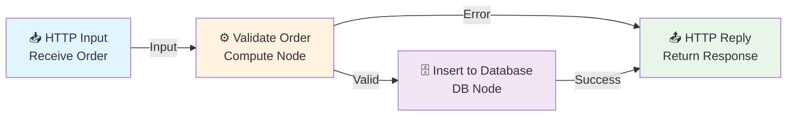

# IBM ACE Message Flow to Mermaid Diagram Generator

## Purpose
This skill analyzes IBM AppConnect Enterprise (ACE) message flows and automatically generates mermaid diagrams to visualize:
- Message flow structure and connections
- Node types and configurations
- Message routing paths
- Error handling flows
- Data transformation pipelines

## Usage

### Analyze a Message Flow File
```
@skill ibm-ace-mermaid "Analyze /path/to/messageflow.msgflow"
```

### Generate Diagram with Custom Options
```
@skill ibm-ace-mermaid "Create mermaid diagram for ACE flow: include error handlers, color-code by node type"
```

### Compare Multiple Flows
```
@skill ibm-ace-mermaid "Compare flows flow1.msgflow and flow2.msgflow, show differences in diagram"
```

## Capabilities

### Message Flow Parsing
- **Supported Formats**: .msgflow (XML), .xml, JSON representations
- **Node Types**: Input, Output, Filter, Compute, Database, HTTP Call, Message Broker, etc.
- **Connections**: Identifies message routing, success paths, error paths
- **Configuration**: Extracts node settings, properties, and parameters

### Diagram Generation
- **Graph Visualization**: Flow structure with proper node positioning
- **Color Coding**: Different colors for different node types
- **Path Highlighting**: Success paths (solid), error paths (dashed)
- **Annotations**: Labels for transformations, conditions, and routing logic
- **Legend**: Includes node type definitions and path meanings

### Analysis Output
- Flow complexity metrics
- Entry and exit points
- Error handling paths
- Data transformation steps
- External service integrations

## Examples

### Input: IBM ACE Message Flow (XML)
```xml
<messageFlow name="OrderProcessing">
  <nodes>
    <inputNode name="HTTPInput" nodeType="HTTPInputNode"/>
    <computeNode name="ValidateOrder" nodeType="ComputeNode"/>
    <databaseNode name="InsertToDB" nodeType="DatabaseNode"/>
    <outputNode name="HTTPOutput" nodeType="HTTPReplyNode"/>
  </nodes>
  <connections>
    <connection source="HTTPInput" target="ValidateOrder"/>
    <connection source="ValidateOrder" target="InsertToDB"/>
    <connection source="InsertToDB" target="HTTPOutput"/>
  </connections>
</messageFlow>
```

### Output: Mermaid Diagram


## Node Type Indicators
- 📥 Input Nodes (HTTP, MQ, File)
- 📤 Output Nodes (HTTP Reply, MQ Put)
- ⚙️ Compute Nodes (Transformations, Logic)
- 🗄️ Database Nodes (SQL, Operations)
- 🔄 Routing Nodes (Switch, Filter)
- ⚠️ Error Handlers

## Features
✅ Automatic flow parsing and analysis
✅ Interactive mermaid diagram generation
✅ Color-coded node types
✅ Error path visualization
✅ Metrics and complexity analysis
✅ Multiple export formats
✅ Batch processing of multiple flows
✅ Diagram customization options

## Integration Points
- Works with ACE Designer exported flows
- Compatible with CI/CD pipelines
- Generates diagrams for documentation
- Supports automated testing scenarios
