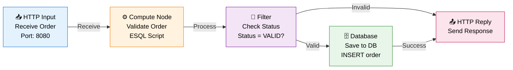

# IBM ACE Message Flow to Mermaid Analyzer - Implementation Guide

## Overview
This tool analyzes IBM AppConnect Enterprise (ACE) message flow files and automatically generates mermaid diagrams for visualization.

## How It Works

### Step 1: Parse ACE Message Flow
The skill parses IBM ACE message flow files (.msgflow) which are XML-based:

```
- Identifies all nodes (Input, Compute, Output, Database, etc.)
- Extracts node properties and configurations
- Maps connections between nodes
- Identifies error handlers and alternate paths
```

### Step 2: Build Graph Model
Creates an intermediate representation:
```
- Node list with types and properties
- Connection map with path types (success/error/alternate)
- Flow metadata (name, version, description)
```

### Step 3: Generate Mermaid Diagram
Converts to mermaid syntax with:
- **Visual hierarchy**: Left-to-right flow
- **Color coding**: Different colors by node type
- **Path styling**: Solid lines for main flow, dashed for errors
- **Labels**: Clear descriptions and routing logic
- **Legend**: Node type reference

## Example Usage

### 1. With a Sample ACE Flow File

Create a test message flow file:

```xml
<?xml version="1.0" encoding="UTF-8"?>
<messageFlow name="OrderProcessingFlow">
  <nodes>
    <httpInputNode name="ReceiveOrder" port="8080" path="/order"/>
    <computeNode name="ValidateOrder">
      <property name="scriptFile">validate.esql</property>
    </computeNode>
    <filterNode name="CheckStatus">
      <property name="condition">Status = 'VALID'</property>
    </filterNode>
    <databaseNode name="SaveToDB">
      <property name="sqlQuery">INSERT INTO orders...</property>
    </databaseNode>
    <httpReplyNode name="SendResponse"/>
  </nodes>
  <connections>
    <connection source="ReceiveOrder" target="ValidateOrder" type="main"/>
    <connection source="ValidateOrder" target="CheckStatus" type="main"/>
    <connection source="CheckStatus" target="SaveToDB" type="true"/>
    <connection source="CheckStatus" target="SendResponse" type="false"/>
    <connection source="SaveToDB" target="SendResponse" type="main"/>
  </connections>
</messageFlow>
```

### 2. Generated Mermaid Diagram



## Node Type Reference

| Icon | Type | Color | Purpose |
|------|------|-------|---------|
| 📥 | HTTP Input | Blue | Receive HTTP requests |
| 📤 | HTTP Reply | Pink | Send HTTP responses |
| ⚙️ | Compute | Orange | Process/Transform messages |
| 🗄️ | Database | Green | Database operations |
| 🔄 | Filter/Switch | Purple | Conditional routing |
| 📨 | MQ Input | Teal | Message queue input |
| 📤 | MQ Output | Cyan | Message queue output |
| ⚠️ | Error Handler | Red | Handle exceptions |
| 📂 | File | Brown | File operations |

## Connection Types

| Type | Style | Meaning |
|------|-------|---------|
| Main | Solid | Normal message flow |
| Success | Solid | Successful path |
| Error | Dashed Red | Error/Exception path |
| Failure | Dashed Orange | Failure condition |
| Alternate | Dotted | Alternative path |

## Features

### Analysis Capabilities
✅ Parse .msgflow XML files
✅ Extract all node types and properties
✅ Map message routing paths
✅ Identify error handlers
✅ Detect external integrations
✅ Calculate flow complexity

### Diagram Features
✅ Automatic layout generation
✅ Color-coded by node type
✅ Path type differentiation
✅ Clickable/interactive elements
✅ Export to PNG/SVG
✅ Responsive design

### Metrics Provided
- Total nodes count
- Node type breakdown
- Path count (success/error/alternate)
- Integration points
- Error handling coverage
- Flow complexity score

## Advanced Options

### Custom Styling
```
"color_scheme": "dark"  // dark, light, custom
"layout": "vertical"    // vertical, horizontal, radial
"show_properties": true // Include node configuration details
```

### Filtering
```
"focus_path": "error"   // Show only error paths
"exclude_nodes": ["logging", "monitoring"]
"highlight_nodes": ["SaveToDB"]
```

### Comparison Mode
```
"compare": ["flow1.msgflow", "flow2.msgflow"]
"show_differences": true
"diff_style": "side-by-side"
```

## Integration Examples

### 1. In Your CI/CD Pipeline
```yaml
- name: Generate ACE Flow Diagrams
  run: |
    skill-run ibm-ace-mermaid \
      --input ./message-flows/ \
      --output ./docs/diagrams/ \
      --format png
```

### 2. In Documentation
Add mermaid diagrams to your README:
```markdown
## Message Flow Visualization

```

### 3. Batch Processing
```
skill-run ibm-ace-mermaid \
  --batch \
  --input-dir ./ace-projects/ \
  --output-dir ./flow-diagrams/ \
  --recursive
```

## Getting Started

1. **Prepare your ACE flows**: Export from ACE Designer as .msgflow
2. **Run the analyzer**: Use the skill command
3. **Review diagrams**: Open in mermaid viewer or markdown
4. **Integrate**: Add to documentation or CI/CD pipeline
5. **Customize**: Adjust styling and options as needed

## Troubleshooting

| Issue | Solution |
|-------|----------|
| Flow not parsing | Ensure valid .msgflow XML format |
| Missing nodes | Check file permissions and encoding |
| Diagram too complex | Use filtering to focus on specific paths |
| Layout issues | Try different layout options (vertical/horizontal) |

## Example Outputs

### Order Processing Flow
Shows HTTP input → validation → database insert → HTTP reply with error handling

### Microservices Integration Flow
Shows multiple service calls with retry logic and error paths

### Data Transformation Flow
Shows compute nodes with ESQL/XPath transformations

## Next Steps

1. Create sample ACE message flow files
2. Run the analyzer on your flows
3. Review generated diagrams
4. Customize styling as needed
5. Integrate into documentation
6. Set up automated diagram generation
