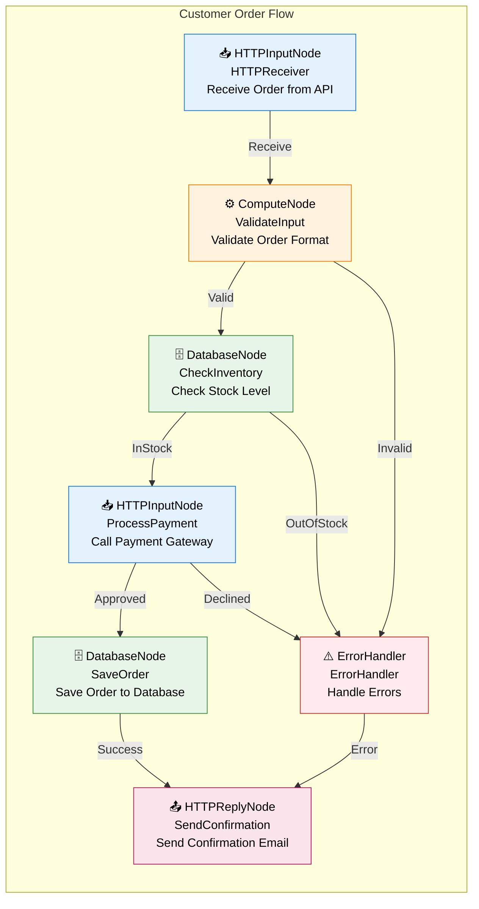

# Skill Agent: IBM ACE Message Flow to Mermaid Diagram Generator

This skill provides AI-powered analysis and visualization of IBM AppConnect Enterprise (ACE) message flows, automatically converting them into interactive mermaid diagrams.

## What It Does

The skill agent:
1. **Parses** IBM ACE message flow files (.msgflow XML format)
2. **Analyzes** the flow structure, node types, connections, and error handling
3. **Generates** beautiful mermaid diagrams for visualization
4. **Produces** metrics and complexity analysis
5. **Exports** diagrams in multiple formats

## Quick Start

### Example 1: Parse and Visualize an ACE Flow

Create a message flow XML file:

```xml
<?xml version="1.0" encoding="UTF-8"?>
<messageFlow name="CustomerOrderFlow">
    <node name="HTTPReceiver" type="HTTPInputNode" description="Receive Order from API"/>
    <node name="ValidateInput" type="ComputeNode" description="Validate Order Format"/>
    <node name="CheckInventory" type="DatabaseNode" description="Check Stock Level"/>
    <node name="ProcessPayment" type="HTTPRequestNode" description="Call Payment Gateway"/>
    <node name="SaveOrder" type="DatabaseNode" description="Save Order to Database"/>
    <node name="SendConfirmation" type="HTTPReplyNode" description="Send Confirmation Email"/>
    <node name="ErrorHandler" type="ErrorHandler" description="Handle Errors"/>
    
    <connection source="HTTPReceiver" target="ValidateInput" label="Receive" type="main"/>
    <connection source="ValidateInput" target="CheckInventory" label="Valid" type="main"/>
    <connection source="ValidateInput" target="ErrorHandler" label="Invalid" type="error"/>
    <connection source="CheckInventory" target="ProcessPayment" label="InStock" type="main"/>
    <connection source="CheckInventory" target="ErrorHandler" label="OutOfStock" type="error"/>
    <connection source="ProcessPayment" target="SaveOrder" label="Approved" type="main"/>
    <connection source="ProcessPayment" target="ErrorHandler" label="Declined" type="error"/>
    <connection source="SaveOrder" target="SendConfirmation" label="Success" type="main"/>
    <connection source="ErrorHandler" target="SendConfirmation" label="Error" type="error"/>
</messageFlow>
```

**Generated Mermaid Diagram Output:**



## Usage Modes

### Mode 1: Direct Python Script Usage

```bash
python ace-mermaid-generator.py
```

Output includes:
- Generated mermaid diagram syntax
- Flow metrics (node count, complexity score, error paths)
- Node type breakdown

### Mode 2: Using as an Imported Module

```python
from ace_mermaid_generator import ACEFlowParser, MermaidDiagramGenerator

# Parse XML flow
with open("order_flow.msgflow", "r") as f:
    xml_content = f.read()

flow = ACEFlowParser.parse_xml(xml_content)

# Generate diagram
diagram = MermaidDiagramGenerator.generate_with_legend(flow, "Order Processing")

# Print or save
print(diagram)

# Get metrics
metrics = flow.get_metrics()
print(f"Flow Complexity: {metrics['complexity_score']}")
```

### Mode 3: CLI Tool Integration

```bash
# Run analysis on a flow file
python -m ace_mermaid_generator --input order_flow.msgflow --output diagram.mmd

# Batch process multiple flows
python -m ace_mermaid_generator --batch --input-dir ./flows --output-dir ./diagrams
```

## Supported Node Types

| Node Type | Icon | Purpose | Color |
|-----------|------|---------|-------|
| HTTPInputNode | 📥 | Receive HTTP requests | Blue |
| HTTPReplyNode | 📤 | Send HTTP responses | Pink |
| ComputeNode | ⚙️ | Transform/process messages | Orange |
| DatabaseNode | 🗄️ | Database operations | Green |
| FilterNode | 🔄 | Conditional routing | Purple |
| SwitchNode | 🔀 | Multi-way branching | Purple |
| MQInputNode | 📨 | Message queue input | Teal |
| MQOutputNode | 📤 | Message queue output | Cyan |
| FileInputNode | 📂 | File read operations | Brown |
| FileOutputNode | 📁 | File write operations | Orange |
| ErrorHandler | ⚠️ | Exception handling | Red |
| ThrowNode | 💥 | Throw exceptions | Red |

## Connection Types

| Type | Style | Use Case |
|------|-------|----------|
| main | Solid black | Primary flow path |
| success | Solid black | Successful operation |
| error | Dashed red | Error/exception handling |
| failure | Dashed orange | Failure condition |
| alternate | Dotted purple | Alternative path |

## Flow Metrics

The skill generates automatic metrics:

```json
{
  "total_nodes": 7,
  "node_types": {
    "HTTPInputNode": 1,
    "ComputeNode": 1,
    "DatabaseNode": 2,
    "HTTPReplyNode": 1,
    "ErrorHandler": 1,
    "HTTPRequestNode": 1
  },
  "total_connections": 9,
  "error_paths": 3,
  "complexity_score": 16
}
```

## Advanced Usage

### Custom Styling

```python
# Generate with custom colors
diagram = MermaidDiagramGenerator.generate(flow)

# Add custom styling
diagram += "\n\nstyle CustomNode fill:#ff6b6b,stroke:#c92a2a,color:#fff"
```

### Filtering Specific Paths

```python
# Get only error paths
error_connections = [c for c in flow.connections if c.conn_type in ["error", "failure"]]

# Analyze critical flows
critical_nodes = [n for n in flow.nodes.values() if "database" in n.name.lower()]
```

### Generate Comparison Diagrams

```python
# Parse two flows
flow1 = ACEFlowParser.parse_xml(xml1)
flow2 = ACEFlowParser.parse_xml(xml2)

# Compare metrics
print(f"Flow 1 Nodes: {len(flow1.nodes)}")
print(f"Flow 2 Nodes: {len(flow2.nodes)}")
```

## Integration Examples

### 1. Documentation Generation

```python
# Generate documentation with embedded diagrams
with open("FLOWS.md", "w") as f:
    f.write("# Message Flow Documentation\n\n")
    
    for flow_file in glob.glob("*.msgflow"):
        flow = ACEFlowParser.parse_xml(open(flow_file).read())
        diagram = MermaidDiagramGenerator.generate_with_legend(flow)
        
        f.write(f"## {flow.name}\n\n")
        f.write("```mermaid\n")
        f.write(diagram)
        f.write("\n```\n\n")
        f.write(f"Metrics: {json.dumps(flow.get_metrics(), indent=2)}\n\n")
```

### 2. CI/CD Pipeline Integration

```yaml
name: Generate ACE Flow Diagrams
on: [push]
jobs:
  generate-diagrams:
    runs-on: ubuntu-latest
    steps:
      - uses: actions/checkout@v2
      - uses: actions/setup-python@v2
      - run: |
          python -m pip install -r requirements.txt
          python -m ace_mermaid_generator --batch \
            --input-dir ./ace-flows \
            --output-dir ./docs/diagrams
      - uses: actions/upload-artifact@v2
        with:
          name: flow-diagrams
          path: docs/diagrams/
```

### 3. Real-Time Flow Analysis

```python
# Watch directory and regenerate diagrams on change
import watchdog.observers
import watchdog.events

class FlowChangeHandler(watchdog.events.FileSystemEventHandler):
    def on_modified(self, event):
        if event.src_path.endswith(".msgflow"):
            flow = ACEFlowParser.parse_xml(open(event.src_path).read())
            diagram = MermaidDiagramGenerator.generate_with_legend(flow)
            print(f"Updated: {flow.name}\n{diagram}")

observer = watchdog.observers.Observer()
observer.schedule(FlowChangeHandler(), path="./flows", recursive=True)
observer.start()
```

## Files Included

1. **SKILL.md** - Skill definition and capabilities
2. **ace-mermaid-analyzer.md** - Comprehensive usage guide
3. **ace-mermaid-generator.py** - Python implementation
4. **skill-instructions.md** - This file

## Requirements

- Python 3.7+
- Standard library only (no external dependencies for core functionality)
- Optional: `watchdog` for file monitoring
- Optional: `mermaid-cli` for diagram export to PNG/SVG

## Troubleshooting

### Issue: "Invalid XML" error
**Solution**: Ensure the .msgflow file is valid XML. Check for:
- Proper opening/closing tags
- Escaped special characters
- UTF-8 encoding

### Issue: Missing nodes in diagram
**Solution**: Verify node elements have required attributes:
- `name` - node identifier
- `type` - node class name

### Issue: Diagram too complex
**Solution**: Use filtering to focus on specific aspects:
```python
# Filter to specific nodes
main_nodes = [n for n in flow.nodes.values() 
              if n.node_type != NodeType.ERROR_HANDLER]
```

## Next Steps

1. ✅ Place ACE flow files in your project
2. ✅ Run the generator on your flows
3. ✅ Review generated diagrams
4. ✅ Customize styles as needed
5. ✅ Integrate into documentation
6. ✅ Set up automated generation in CI/CD

## Support

For issues or enhancements, check:
- Mermaid documentation: https://mermaid.js.org
- IBM ACE documentation: https://www.ibm.com/docs/en/app-connect/enterprise
